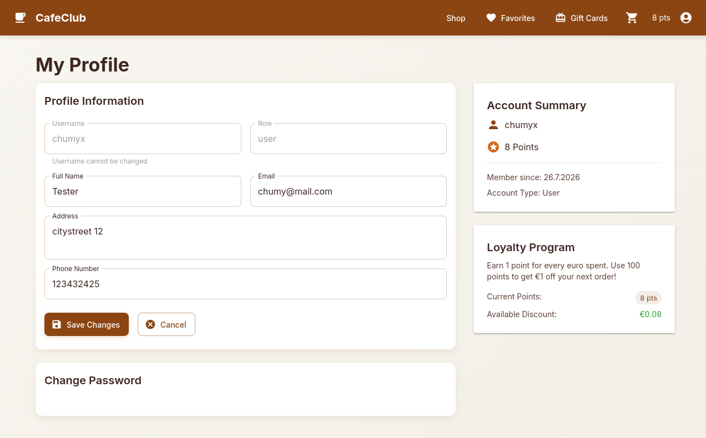
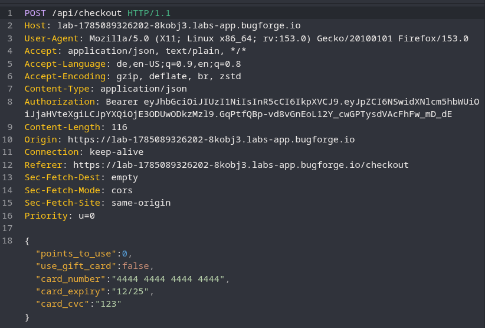
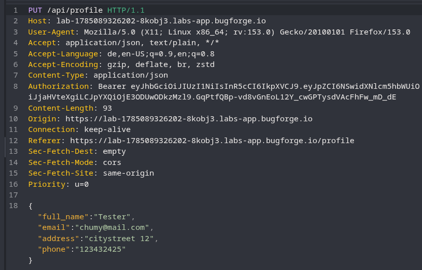
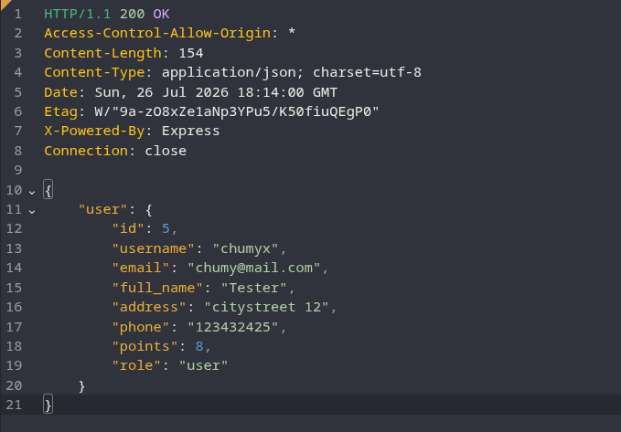
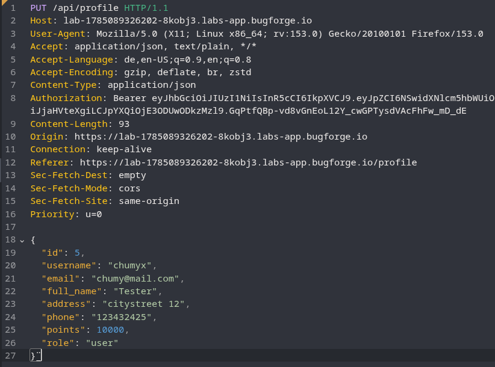

# CafeClub Challange 26-07-26

In this lab, there was a "CafeClub" where you could order coffee.

First, I submitted an order and used Caido to analyze the HTTP traffic.

Maybe we can get some loyalty points to pay for our order.

If we go to our profile, we can see that we have the option to edit it.

Now, let's take a look at the requests in Caido/Burp.

Let's change the HTTP method from `PUT` to `GET`.

Maybe we can try using a `PUT` request to grant ourselves some points.

After sending the request, the flag appears in the response.
