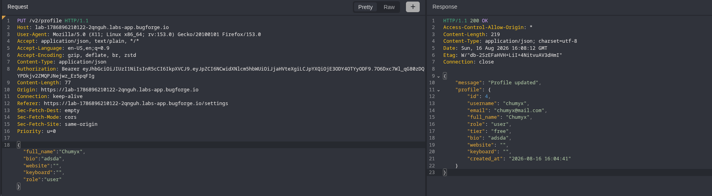
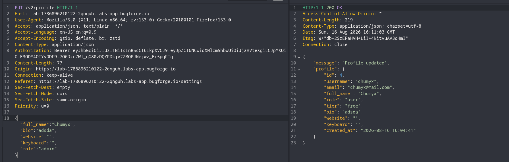
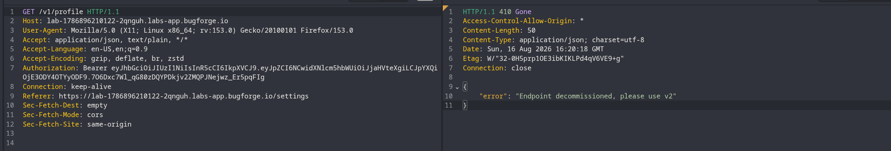
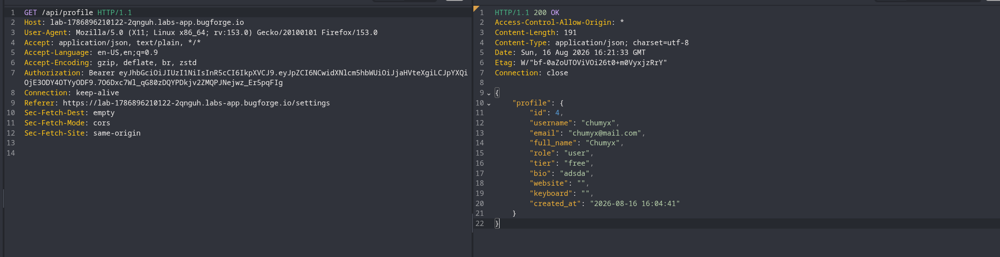
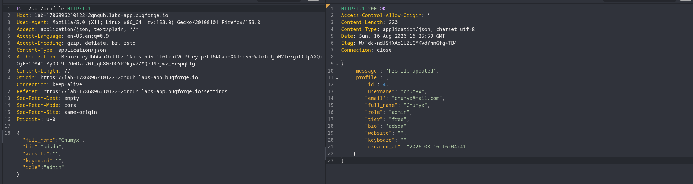
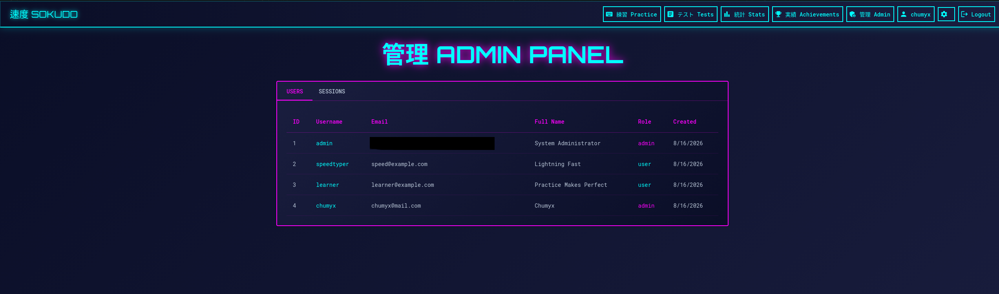

# Sokudo 16-08-26 Writeup

> **Date:** 16.08.2026  
> **Author** Chumyx  
> **Category:** Web Security  
> **Difficulty:** 2/5 

---
<details>
<summary>Hint</summary>
<div style="background-color: #7d6433; border-left: 5px solid #dd6b20; padding: 10px 14px; border-radius: 4px; margin: 12px 0; color: White">
Can you become the admin?
</div>
</details>

## 1. Reconaissance
The target appilcation **Soduko** is a typing speed platform.

After registering and creating a standard user account, I navigated to the profile settings where user details can be updated.

Using **`Caido`** to inspect the profile update.




We notice that our user profile includes a **`role`** parameter. We then attempt to change this role from **`api`** to **`admin`**.



But we can't change the role.

```bash
curl -s "https://https://lab-1786914424321-1ec8nh.labs-app.bugforge.io.labs-app.bugforge.io/staitc/js/main.df94ac42.js" -o output.js
```

```bash
grep -oE '/[a-zA-Z0-9_/?&=-]+' output.js | sort -u
```


---

## 2.API Version

To check for legacy API endpoints with weaker validation or missing parameter filtering. I tested alternative route prexifes. 

- Testing **`v1`**



- Testing **`api`**




The unversioned **`/api`** endpoint resolved successfully and accepted profile update requests.

--- 
## 3. Privilege Escaltion

I replay the profile updat payload against the legacy **`/api`** route, injecting the admin role.



The legacvy endpont accepted the parameter without server-side validation. Refeshing the web application the privilege escaltion to the Admin role

